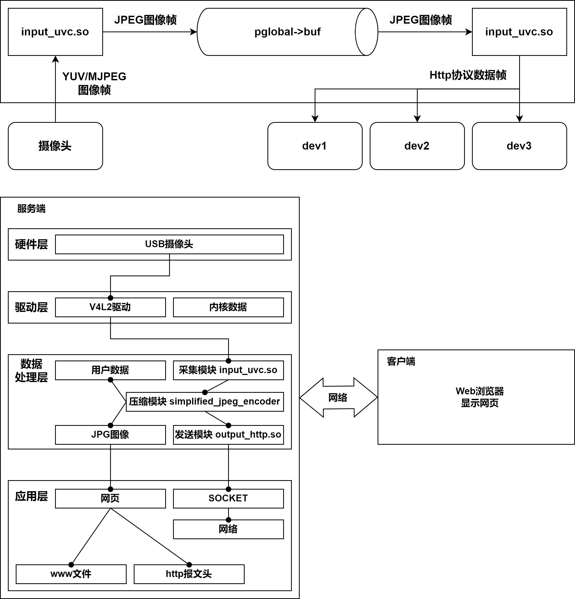
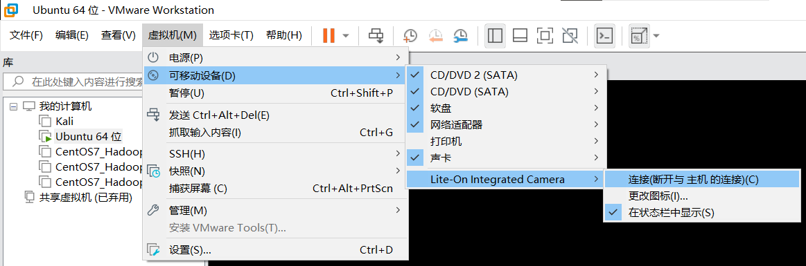

# RomoteVideoMonitoringSystem
A  project about Romote Video MONITORING System By QT 6.2 - BASE 

一个简单的远程视频监控系统

### 项目开发流程
1. **需求分析 :** 明确系统的功能要求
2. **概要设计 :** 设计系统的整体架构和模块划分
3. **详细设计 :** 设计每个模块的组织结构和执行流程
4. **编写代码 :** 编程实现每个模块的具体功能
5. **测试运行 :** 测试功能, 修改 BUG
6. **升级维护 :** 优化程序, 增加功能

**需求分析**
- 使用 UVC 摄像头, 实时获取视频, 通过 Http 协议传输视频数据, 并实时显示到 Web 浏览器或者 PC客户端
  - 在 ubuntu 系统架设视频服务器 (mjpg-streamer), 实现抓取视频图像数据利用 HTTP 协议实现和视频服务器的数据交互, 编写客户端程序(C++), 向视频服务器发送获取视频的请求, 并接收响应数据
  - 分析视频服务器的响应数据格式, 从返回的数据中剥离出保存一帧图像, 即一张 JPEG 格式的图片, 获取的图片可以用图形查看工具直接打开使用 QT 的网络编程框架, 向视频服务器发送获取视频或截图请求, 并通过 QT 的信号和槽机制实时接收服务返回的响应数据, 从中剥离出 JPEG 图像并显示到 QT 界面, 通过不断刷新显示JPEG 图像的方式, 实现视频监控的客户端
- 通过 QT 客户端查看视频监控画面
- 通过 QT 客户端查看快照

**概要设计**
- 远程视频监控系统结构框图
  

**详细设计**
- ***Mjpeg-streamer*** 简介
  - 网络视频服务器(Mjpg-streamer), 采用多线程的工作方式, 可以获取 UVC 摄像头的视频数据, 并利用网络将视频数据发送给客户端
  - Mjpg-streamer 内置 HTTP 服务器 (Web Server), 用户可以通过浏览器直接访问服务器从而获取视频, 也可以通过 HTTP 协议, 编写 Qt 客户端, 实现获取和显示视频流
  
  - Qt 视频监控客户端
    - 创建 QT 应用程序与服务器建立连接
    - 向服务器发送获取视频请求
      - `GET /?action=stream HTTP/1.1 \r\n\r\n`
    - 接收服务器的响应数据
    - 从响应数据中剥离出一张干净的 JPEG 图像帧
    - 将 JPEG 图像帧显示到 QT 界面
    - 重复以上操作, 不断更新显示 QT 界面的图像帧, 最终看到的将是视频流

**编写代码**
- 在 Ubuntu 搭建 mjpg 视频服务器 (需要 `make`、`cmake`、 `build-essential`等)
  - 执行 make, 完成源代码编译
  - 使用**测试图片**运行服务器 

    `mjpg_streamer -i "./input_testpicture.so -r 320×240 -d 1000" -o "./output_http.so" -w ./www`
  - 使用**UVC摄像头**运行服务器 

    `mjpg_streamer -i "./input_uvc.so -n -f 10 -r 320×240 -d /dev/video0" -o "./output_http.so" -w ./www` 

    需注意摄像头的块号并不一定为 `/dev/video0` , 有可能是 `/dev/video1` , 此处需要根据实际情况选择
  - 在虚拟机使用摄像头时请注意, 需要先设置将其打开, 打开后下图最右侧按钮常亮 

    
  - 可以使用: 虚拟机 -> 可移动设备 -> Lite-On Integrated Camera -> 连接(断开与主机的连接)进行打开
    
  - 可以使用 `ls /dev/video*` 查看摄像头设备
- Qt 视频监控客户端编码
  - 使用 Qt 网络应用开发相关类 `QNetworkAccessManager`、`QNetworkRequest`、`QNetworkReply` 管理 HTTP 通信过程
  - 发送获取视频或快照请求
  - 接收响应数据并保存
  - 从响应数据中剥离图像帧
  - 在 `QLabel` 空间上显示图像帧或快照
  - 重复以上过程, 即可看到实时视频监控画面
- **Qt OpenCV** 的搭建
  > Blog : https://blog.csdn.net/article/details/112975207
  - https://opencv.org/releases/